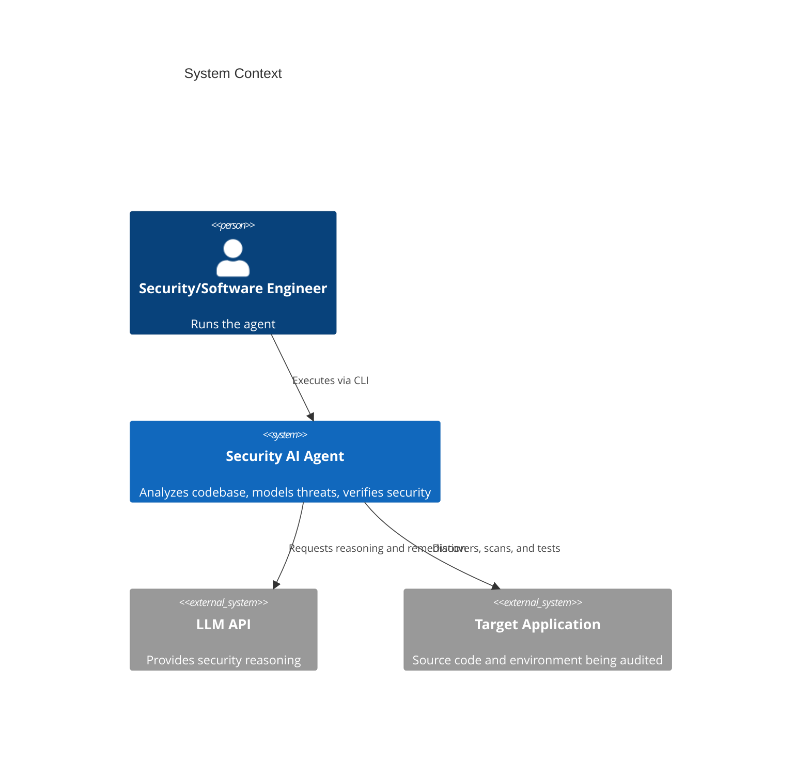
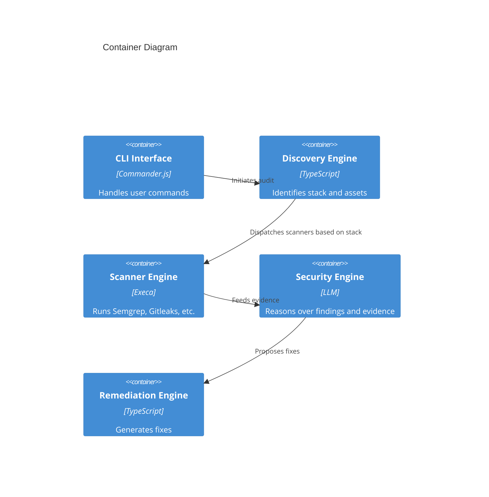

# System Architecture

## Overview
Security Secure System AI Agent is a standalone security engineering AI agent for discovery, threat modeling, SAST, dependency analysis, secrets scanning, AI reasoning, remediation, and verification.

## C4 Context Diagram

## C4 Container Diagram

