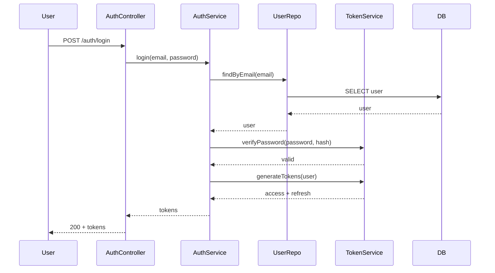
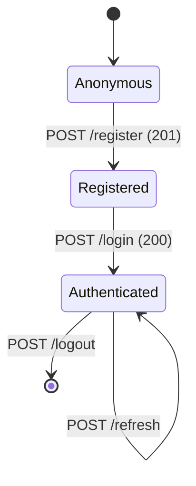

# User Authentication - Architecture

## Overview

Stateless JWT authentication. Backend issues signed tokens; middleware validates them on protected routes.

## Components

### Backend

- AuthController - HTTP endpoints
- AuthService - registration, login, refresh logic
- UserRepository - user data access
- TokenService - JWT sign/verify
- AuthMiddleware - protected route guard

### Database

- `users` table: id, email (unique), password_hash, created_at, updated_at
- `refresh_tokens` table: id, user_id, token_hash, expires_at, revoked_at

## Data Flow

## State

## Security

- bcrypt (cost 12) for passwords
- JWT access token: 15 min expiry
- JWT refresh token: 30 days, rotated
- HTTPS only, Secure + HttpOnly cookies option
- Brute force: 10 attempts / 15 min / IP lockout
- Rate limit: 10 req/min per IP on auth endpoints

## Performance

- Index on `users.email`
- Index on `refresh_tokens.user_id`
- Token verification stateless (no DB hit)

## Decisions

- ADR-002: JWT for stateless auth

## Related

- [README](./README.md)
- [PRD](./prd.md)
- [API](./api.md)
