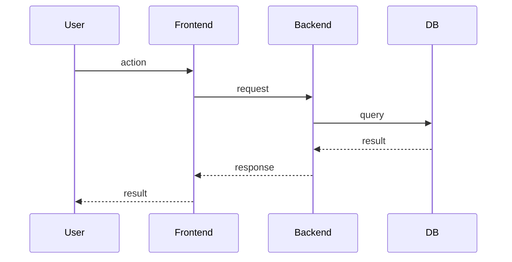

# {Feature Name} - Architecture

## Overview

{Summary}

## Components

### Frontend

{Components, state, flows}

### Backend

{Services, endpoints, logic}

### Database

{Schema changes, new tables/columns}

### Integrations

{External systems}

## Data Flow

## State

{State machine or state transitions}

## Security

{Authentication, authorization, data protection}

## Performance

{Performance considerations}

## Decisions

- ADR-{n}: {decision} (see [ADRs](../../adr/))

## Related

- [README](./README.md)
- [PRD](./prd.md)
- [API](./api.md)
